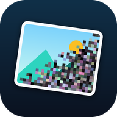
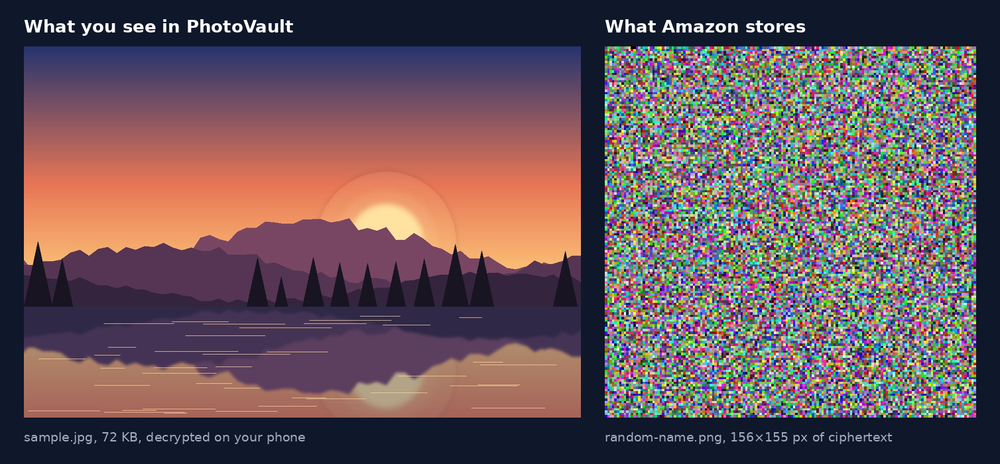
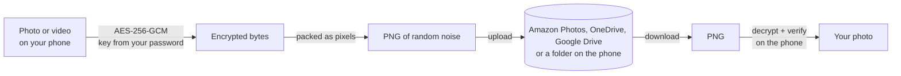

# Cloakroll

**Private photo backup on Amazon Photos, OneDrive, Google Drive or only on your phone. Everything is encrypted on your phone, so the cloud only ever stores noise.**

*Formerly PhotoVault. The vault folder in the cloud keeps the name `PhotoVault`, so existing vaults keep working.*

Amazon Prime includes unlimited full-resolution photo storage, and OneDrive and Google Drive come with many Microsoft and Google accounts. Cloakroll uses that space without handing over your pictures: each photo or video is encrypted on the phone with AES-256 and uploaded as a PNG image of random pixels. Only Cloakroll, with your password, can turn it back into your photo.



> **Status: beta (v1.9.2).** Android 13 or newer. Not affiliated with, endorsed by or connected to Amazon, Microsoft or Google.
>
> ♥ **Cloakroll is free and lives on donations: [buy me a coffee](https://buymeacoffee.com/rimaturus)** if it is useful to you.

---

## Our promise

| | |
|---|---|
| **No ads** | Not now, not later. |
| **No tracking** | No analytics, no crash reporting, no third-party SDKs. The app has **zero** third-party libraries. |
| **No data collection, no data selling** | There are no Cloakroll servers and no Cloakroll accounts. The app talks only to the cloud storage you choose (Amazon Photos, OneDrive or Google Drive), and only sends it encrypted files. We never receive anything, so there is nothing to sell or to leak. |
| **Open source** | GPL-3.0. About 4,000 lines of plain Java and Python that anyone can read. The whole cryptography is in one file, [`Vault.java`](src/app/photovault/Vault.java) (280 lines). |
| **No lock-in** | Your vault opens without the app too: [`photovault.py`](photovault.py), one small Python file, decrypts it on any PC. [How](#recover-your-files-without-the-app). |
| **Donation-funded** | Cloakroll is free. Donations are voluntary and unlock nothing: every feature is free for everyone. [Support the project](#support-the-project). |

## Why

Cloud photo services scan what you upload: faces, places, objects, text. That data can feed search, advertising and model training, and it can leak in a breach or through a compromised account. Cloakroll keeps the storage and removes the content: whoever gets into the cloud copy finds only random pixels.

## How it works



1. You pick photos in Android's photo picker. Cloakroll never gets access to the rest of your gallery.
2. Each file (with its name, date and EXIF metadata) is encrypted on the phone.
3. The ciphertext becomes the pixels of a valid PNG with a random file name. That PNG is all the cloud receives.
4. To view, the app downloads the PNG, checks it has not been modified by a single bit, and decrypts it in memory.

## Security model

### Cryptography

| | |
|---|---|
| Key derivation | PBKDF2-HMAC-SHA256, 600,000 iterations (the OWASP recommendation), random 16-byte salt per vault |
| Encryption | AES-256-GCM, fresh random 96-bit nonce per file, 128-bit authentication tag |
| Integrity | The GCM tag covers the ciphertext and the 36-byte file header: any modification, or a wrong key, is rejected |
| Metadata | File name, date taken and MIME type are inside the encrypted part |
| Implementation | Android's built-in crypto provider only. No custom cipher, no third-party crypto library |

The key is derived from your password and never stored in plain form. Nobody can reset your password: not Amazon, not Microsoft, not the developer.

**Changing the password** gives a new salt and a new key. Every file in the cloud is then downloaded, re-encrypted with the new key, uploaded again, and the old copy moved to the cloud's trash. Meanwhile the previous key is kept on the phone, sealed with the new one, so both kinds of file open; it is deleted when the last file is done. Each file header carries its salt, so the app and `photovault.py` always know which password a file needs.

### What the cloud can and cannot see

| Amazon / Microsoft **can** see | Amazon / Microsoft **cannot** see |
|---|---|
| That you upload PNG files of random noise | Any content of your photos and videos |
| How many files, their sizes, and upload times | Faces, places, objects, text in images |
| That the files are probably encrypted (random data is easy to recognise) | File names, dates, GPS, camera model or any EXIF |
| Your account (you sign in with it) | Your vault password or key |

### On the phone

- **The key lives only in memory while the vault is unlocked.** The app locks itself 60 seconds after you leave it (10 minutes while you are in the photo picker), and wipes the key from memory. A background upload keeps its own copy of the key until it finishes, then wipes it.
- **Optional fingerprint unlock:** the vault key is wrapped by a key in the phone's secure hardware (Android Keystore) that only a strong biometric can release. It is reset automatically if fingerprints change.
- **Everything stored locally is encrypted** with the vault key: the list of items and the small previews. Downloaded originals are cached still encrypted.
- **Decrypted videos** are written to app-private storage only while you watch them, and deleted on close, on lock and at the next start.
- **No backups, no leaks:** Android backup and phone-to-phone transfer are disabled for the app's data. Screenshots and the preview in "recent apps" are blocked (you can allow screenshots temporarily in *Settings*).
- **Amazon sign-in:** the in-app page only shows Amazon's own sign-in sites; any other link opens in your normal browser. The app never sees your Amazon password: it reuses the session cookies of that page.
- **OneDrive sign-in:** on Microsoft's own page, in your browser (OAuth 2.0 with PKCE, no client secret). The app never sees your Microsoft password. It asks only for its own folder, `Apps/PhotoVault`, not your other files. The refresh token is stored encrypted with a key in the phone's secure hardware; the short-lived access token stays in memory.
- **Google Drive sign-in:** the same way, on Google's own page in your browser. The app asks only for `drive.file`: it sees the files it created itself (the folder `Cloakroll`), nothing else in your Drive.
- **Folder on the phone** (vault only on the phone, or the optional encrypted copy next to a cloud): chosen with Android's folder picker, which gives the app access to that folder only. No storage permission.
- **The log** (*Settings → Log*) lists every request made to the cloud, and never contains cookies, tokens, keys, passwords or file names.

### Threat model

**Cloakroll protects your photos against:**
- The cloud provider scanning, analysing or training AI on them
- A breach of the cloud storage, or someone who gets into your Amazon or Microsoft account
- Anyone who modifies the stored files (detected, never silently accepted)

**Cloakroll does not protect against:**
- A weak password. The ciphertext can be attacked offline; PBKDF2 slows each guess down, but only a strong password makes guessing hopeless.
- Malware or someone with access to your phone while the vault is unlocked
- The metadata listed above (number, size, timing of uploads)
- **Losing your password: your photos are then gone for good.** This is the price of real encryption.
- Someone who already downloaded your encrypted files and later learns your password. Changing the password protects everything stored from then on, but not copies taken before.
- The provider deleting files or closing the account. Keep a second backup of anything irreplaceable.

The app has **not** had an independent security audit yet. Reviews and reports are very welcome (see [SECURITY](#reporting-a-security-issue)).

### Permissions

| Permission | Why |
|---|---|
| Internet | Talk to Amazon Photos, OneDrive or Google Drive |
| Biometric | Optional fingerprint unlock |
| Foreground service (data sync) | Uploads and syncs keep running when you leave the app |
| Notifications | Show upload progress (never file names) |
| Network state, boot completed | Let the automatic backup job wait for Wi-Fi and survive a restart (no prompt) |
| Photos and videos (optional) | Asked for only if you turn on **automatic backup**, so it can see new photos. Android 14+ lets you limit it to selected photos |

No contacts, location, camera or microphone permission. Without automatic backup, photos are chosen through Android's photo picker, which grants access only to what you select; a folder on the phone, through Android's folder picker, the same way.

## Features

- **Four storage options**, chosen at setup: Amazon Photos (unlimited photos with Prime, unofficial web interface, on the Amazon site of your account: .com, .co.uk, .de, .it, .co.jp...), OneDrive (official Microsoft Graph API), Google Drive (official Drive API, `drive.file` access only), or **only on this phone**, in a folder you choose
- **Automatic backup** (*Settings*): new photos and videos go to the vault by themselves, on Wi-Fi, even with the app closed, through Android's job scheduler. Choose everything on the phone or only what is added from now on. To encrypt while the vault is locked, a copy of the key stays on the phone, protected by its secure hardware; opening the vault still needs the password
- **Free up space** (*Settings*): photos and videos already in the vault can be removed from the phone in one go; Android's own dialog asks first
- **Encrypted copy on the phone** next to any cloud (setup or *Settings*): every encrypted PNG also goes in a folder you choose, so items open faster and offline, and you have one more backup
- **Time estimates and statistics**: time left while adding or opening files, during *Sync* and a password change (from the speed of the transfer under way, or the measured ones until it has one), and *Settings > Transfer statistics* with the measured upload, download, encryption and decryption speeds of your phone and connection
- Encrypt and upload many photos and videos at once, of any size; big files go up as 32 MB encrypted parts, and a part cut short by the network is sent again by itself instead of failing the whole file. The queue keeps running in the background with a progress notification and a *Stop* button
- Gallery with instant previews. Opening an item shows its small preview (kept encrypted on the phone) and downloads nothing: the full-quality original is fetched only when you tap *Original* or *Save to phone*, so browsing costs no data. Swipe left and right to move between items; pinch or double-tap to zoom
- **Folders**: create folders, long-press photos to select several and *Move* or *Delete* them, rename or delete folders (their photos are kept). Folder names and contents are saved in the cloud in one more encrypted file, together with the list of your items (name, date, size), so the provider can't read them and a new phone gets them back
- *Cloud view* button: see the exact file the cloud stores
- *Privacy policy* readable inside the app (welcome screen and Settings), the same text as `PRIVACY.md`
- A six-page tour at the first open (again from *Settings > About*), and a one-time "what's new" after each update, with a "don't show again"
- Fingerprint unlock, auto-lock, no screenshots
- **Change the vault password** (*Settings > Change vault password*): the app shows first what it costs (data, time), then re-encrypts every file in the cloud with the new key in the background, resuming by itself if interrupted
- *Sync*: restores your vault on a new phone and removes items you deleted on the provider's website. The list comes from that encrypted file, so restoring downloads no photos: previews are made when you open an item, or all at once with *Settings > Download the missing previews*. A file that is damaged in the cloud (it doesn't open on two Syncs) is left where it is and skipped, so it can't hold up a restore or a password change
- Save a decrypted copy back to your gallery
- Self-test on your own account before you store anything: upload, check that the cloud keeps the file bit-for-bit, decrypt, check the storage, clean up
- Light and dark theme, following the phone
- In English, Italian, Spanish, German, French and Portuguese (*Settings > Language*, or Android's per-app language setting)
- Recovery **without the app**, on any PC, with a 115-line Python script

## Install

1. Download `Cloakroll.apk` from [Releases](https://github.com/rimaturus/CloakRoll/releases).
2. Samsung phones: turn off *Settings → Security and privacy → Auto Blocker* while installing.
3. Open the APK and allow installing from that source. Play Protect warns about apps from unknown developers; choose *More details → Install anyway*.

To check that an APK is an official build, compare its signing certificate with this SHA-256 fingerprint (release key, from version 1.9.2; it is also the code transparency key of the Google Play bundle):

```
33:A9:05:10:FE:68:A2:C3:B5:0C:DC:E3:39:AC:7E:20:98:DC:1C:A7:7E:72:D4:D3:68:07:CE:D5:C2:8B:71:7D
apksigner verify --print-certs Cloakroll.apk
```

## First launch

1. **Choose where to store**: Amazon Photos, OneDrive, Google Drive or only this phone; and whether to keep an encrypted copy on the phone too.
2. **Sign in.** Amazon: in the in-app page; the app creates a `PhotoVault` folder in your Amazon Photos. OneDrive: in your browser; the vault goes in `Apps/PhotoVault`. Google Drive: in your browser; the vault goes in the folder `Cloakroll`. Only this phone: pick a folder; the vault goes in its subfolder `Cloakroll`.
3. **Create your vault password.** At least 10 characters; a few random words is ideal. Store it in a password manager.
4. **Self-test.** Eight checks on your real account, with the test image and its encrypted version side by side. Then turn on fingerprint unlock.
5. Tap **Add**.

Already have a vault (new phone, reinstall)? Choose the same storage, sign in, enter the same password, and the app rebuilds the list from the cloud.

## Recover your files without the app

Every file stays readable even if this app disappears.

1. Get the PNGs of the vault folder: from the Amazon Photos, OneDrive or Google Drive website (`PhotoVault`, `Apps/PhotoVault` on OneDrive, `Cloakroll` on Google Drive), or copy the folder `Cloakroll` from the phone.
2. On a PC with Python 3:

```
pip install pillow cryptography
python photovault.py dec downloaded_folder -o recovered
```

The original files come back with their names, bit-for-bit. `photovault.py` can also encrypt (`enc`) and run a round-trip test (`test`).

## File format (PVT2)

The pixel bytes of an 8-bit RGB PNG (read row by row, left to right) are:

```
"PVT2" | salt (16) | nonce (12) | ciphertext length (u64, big-endian) | AES-256-GCM ciphertext + tag | random padding
plaintext = metadata length (u16, big-endian) | metadata JSON {name, taken, mime} | original file bytes
key = PBKDF2-HMAC-SHA256(UTF-8 password, salt, 600000 iterations, 32 bytes)
```

**Big files** (over 32 MB) are split into parts of 32 MB, each one a complete PNG like the above, encrypted and authenticated on its own:

```
part 0 metadata = {name, taken, mime, group, part: 0, parts: n, size, ids: [cloud ids of parts 1..n-1], thumb}
part k metadata = {group, part: k}          group = random id shared by the parts of one file
```

Part 0 is uploaded last because it lists the others. Before joining, the app checks that every part carries the same group and its own index. These checks sit inside the encryption, so parts can't be swapped or reordered unnoticed. `thumb` is a small preview, so a new phone can show big files without downloading them.

The 36-byte header is authenticated as GCM associated data. The format is implemented twice, independently: [`Vault.java`](src/app/photovault/Vault.java) and [`photovault.py`](photovault.py), and the two are cross-tested ([`test/VaultTest.java`](test/VaultTest.java)).

## Build from source

No Gradle and no Android Studio needed. On Ubuntu 24.04:

```
sudo apt install aapt apksigner dalvik-exchange zipalign openjdk-21-jdk-headless zip unzip curl
KS_PASS='a-strong-password' ./build.sh           # creates photovault.jks on first run; DONATE_URL=... to change the donation link
KS_PASS='a-strong-password' PLAY=1 ./build.sh     # Google Play variant: no donation or source links (Play payments policy)
KS_PASS='a-strong-password' PLAY=1 AAB=1 ./build.sh   # the same as an App Bundle (.aab) for Google Play, with code transparency
ONEDRIVE_CLIENT_ID='your-app-id' GOOGLE_CLIENT_ID='your-client-id' KS_PASS='...' ./build.sh   # with OneDrive and Google Drive (PUBLISHING.md)
```

On Windows, with Android Studio installed (its JDK and the SDK build-tools), `build-win.sh` takes the same options from Git Bash.

Without `ONEDRIVE_CLIENT_ID` or `GOOGLE_CLIENT_ID` the app builds fine and shows that option as not available. `build.sh` downloads the Android API jars, compiles, and signs. **Keep `photovault.jks` private and out of git** (it is in `.gitignore`): anyone who has it can sign "updates" that install over your users' copies.

Source layout:

| File | Role |
|---|---|
| `src/app/photovault/Vault.java` | File format and all cryptography (pure Java, testable on a PC) |
| `src/app/photovault/Cloud.java` | What a storage backend must do (list, upload, download, trash) |
| `src/app/photovault/Amazon.java` | Amazon Photos web requests |
| `src/app/photovault/OAuthCloud.java` | Browser sign-in (OAuth 2.0 + PKCE) and token storage, shared by OneDrive and Google Drive |
| `src/app/photovault/OneDrive.java` | OneDrive: Microsoft Graph requests |
| `src/app/photovault/GoogleDrive.java` | Google Drive: Drive API v3 requests |
| `src/app/photovault/Local.java` | A folder on the phone (Android's folder picker): the vault itself, or the encrypted copy |
| `src/app/photovault/Transfers.java` | What the app uses: the storage, timed, plus the optional copy on the phone |
| `src/app/photovault/Stats.java` | Measured speeds, time estimates |
| `src/app/photovault/Store.java` | Shared state, encrypted local index and previews |
| `src/app/photovault/SyncService.java` | Background uploads and sync |
| `src/app/photovault/MainActivity.java` | All screens |
| `src/app/photovault/Ui.java` | Colors, cards, buttons and icons, drawn in code |
| `res/values*/strings.xml` | All texts, one file per language (default: English) |
| `photovault.py` | PC tool, same format |

## Limits and honest risks

- **Amazon: unofficial API.** Amazon has no public Photos API. Cloakroll uses the same private web requests as the Amazon Photos website (the endpoints documented by the open-source [amazon_photos](https://github.com/trevorhobenshield/amazon_photos) project). If Amazon changes them, uploads stop until the app is updated. Your stored files stay decryptable with `photovault.py`.
- **Amazon: terms.** Prime includes unlimited *photos* and 5 GB for *videos*. Storing encrypted videos as PNG images goes against the spirit of that offer, and the more video you store, the more it stands out. Amazon could restrict or close the account. Photos are the intended use; keep another backup of any video you care about.
- **Size.** No limit per item: files over 32 MB are stored as several encrypted parts. A big video is downloaded completely before it plays, so opening a 2 GB video takes a few minutes on Wi-Fi.
- **Password.** It can't be recovered. Changing it re-encrypts the whole vault: every file is downloaded and uploaded again, and until that finishes the old password still opens the files not done yet.
- **OneDrive: storage.** Files count against your OneDrive quota (5 GB free, 1 TB with Microsoft 365). During a password change the old copies stay in the recycle bin, so the vault needs about twice its size for a while.
- **OneDrive: app registration.** Microsoft requires every app that signs in with a Microsoft account to be registered; builds need the registration's client ID (see [PUBLISHING.md](PUBLISHING.md)).
- **Google Drive: storage and registration.** Files count against your Google storage (15 GB free, shared with Gmail and Google Photos). Builds need a Google OAuth client ID (see [PUBLISHING.md](PUBLISHING.md)).
- **Only on this phone.** No cloud copy: a lost or broken phone means a lost vault, unless you copy the folder elsewhere (a PC, a USB drive).
- **No Google Photos.** Google's Photos API doesn't fit: apps may upload only real photos and videos (not other data), can't delete what they upload, and downloads aren't bit-exact, which encrypted files need. Google Drive is offered instead.
- Android limits background data sync to 6 hours a day.

## Support the project

Cloakroll has no ads, no tracking and no paid tier, and never will. If it is useful to you, you can support its development with a voluntary donation:

**[Buy me a coffee](https://buymeacoffee.com/rimaturus)**, also in the app (*Settings > Support Cloakroll*) and behind the **Sponsor** button at the top of this page.

Donations pay for development time and, hopefully one day, an independent security audit. They don't buy features or priority: everything is free for everyone. Starring the repo, reporting bugs and reviewing the code help just as much.

## Reporting a security issue

Please don't open a public issue for vulnerabilities. Use GitHub's *Report a vulnerability* button (Security tab) so it can be fixed before details are public.

## License

[GPL-3.0](LICENSE). You may use, study, share and modify Cloakroll; modified versions you distribute must stay open source under the same license.

*Amazon, Amazon Photos and Prime are trademarks of Amazon.com, Inc. or its affiliates. Microsoft and OneDrive are trademarks of the Microsoft group of companies. Google Drive is a trademark of Google LLC. Cloakroll is an independent project and is not affiliated with or endorsed by Amazon, Microsoft or Google.*
